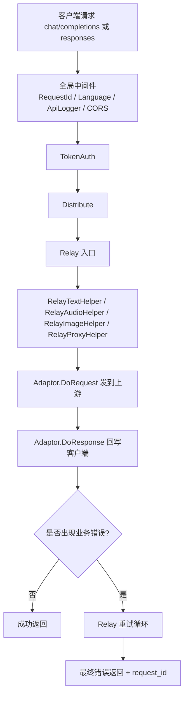
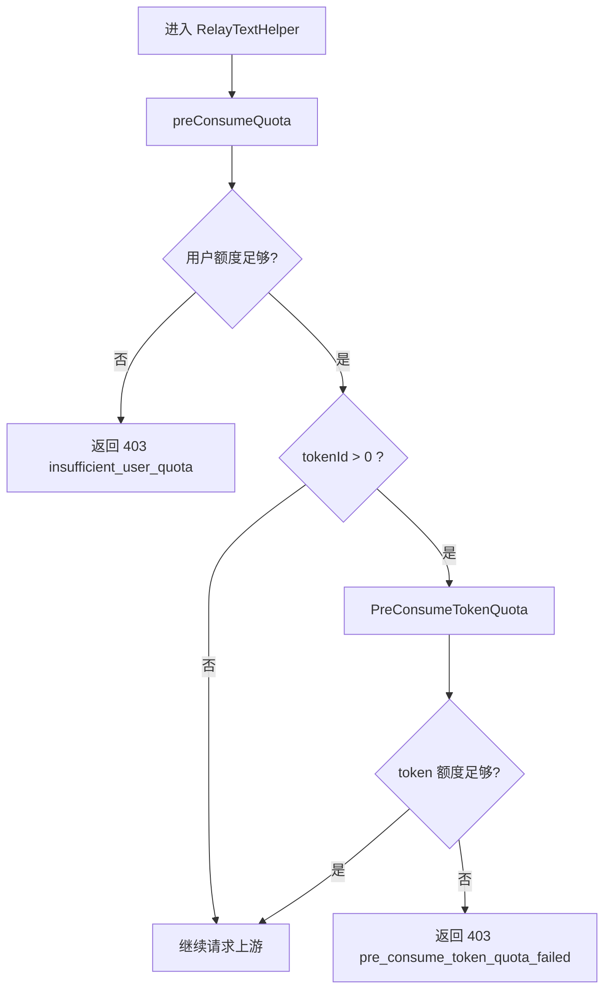
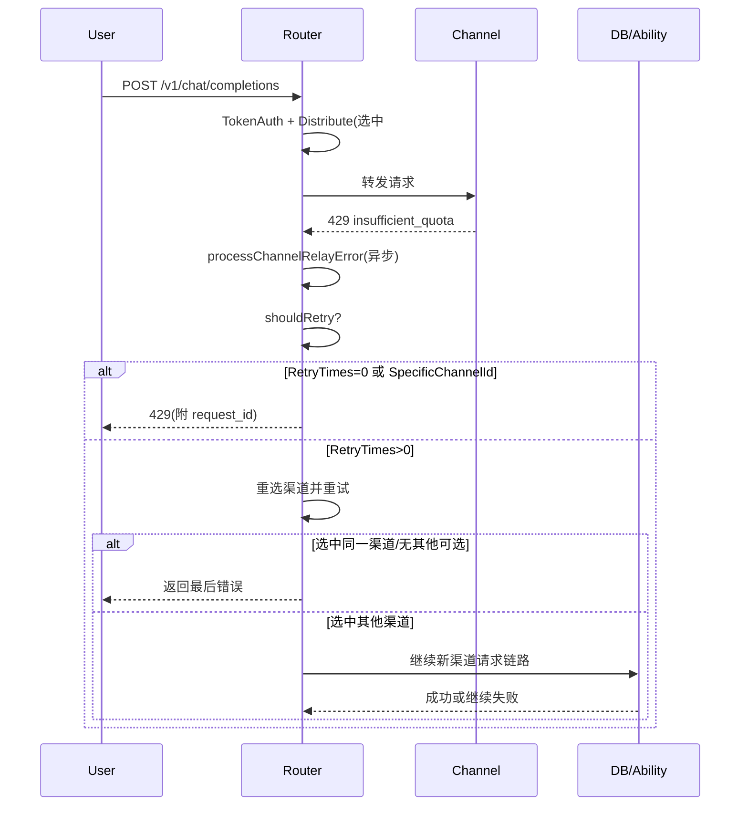
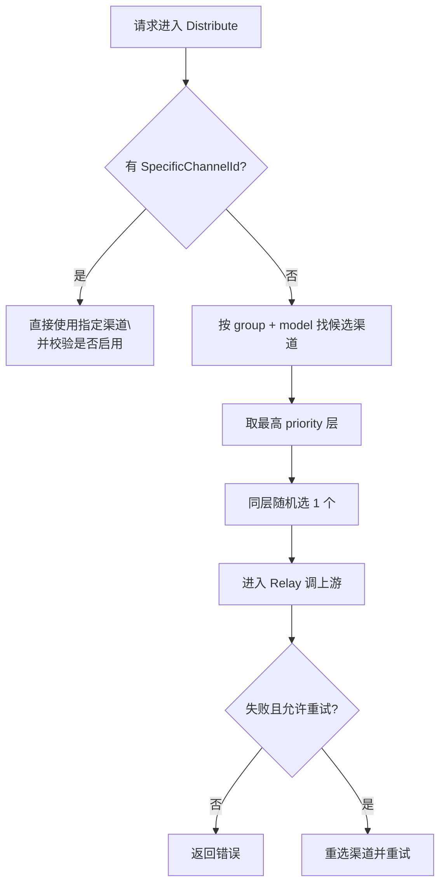
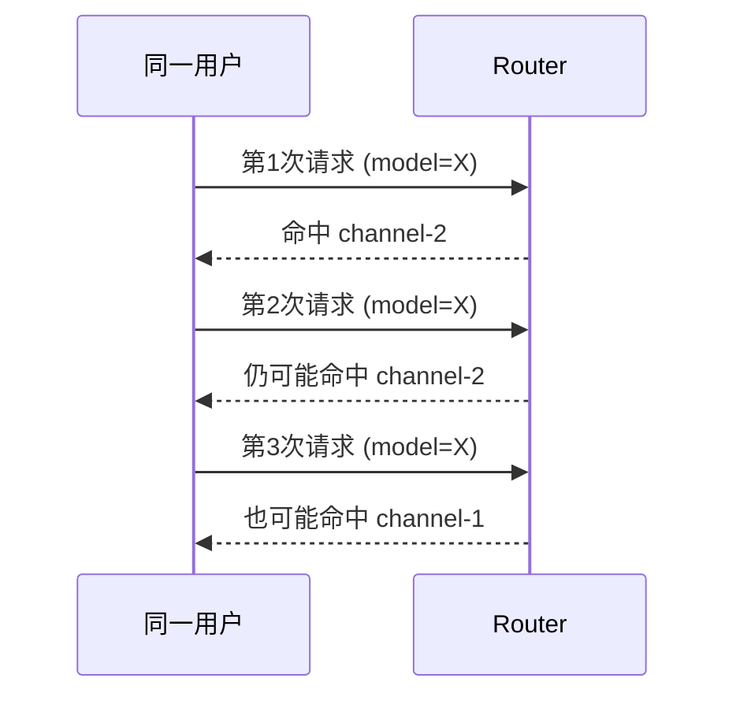
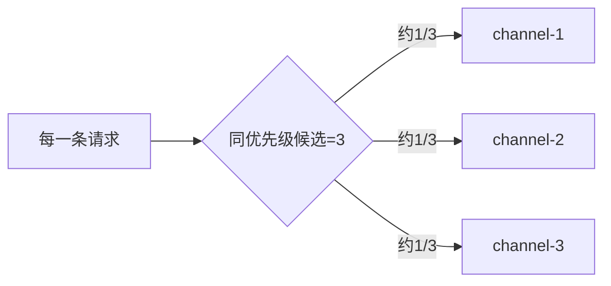
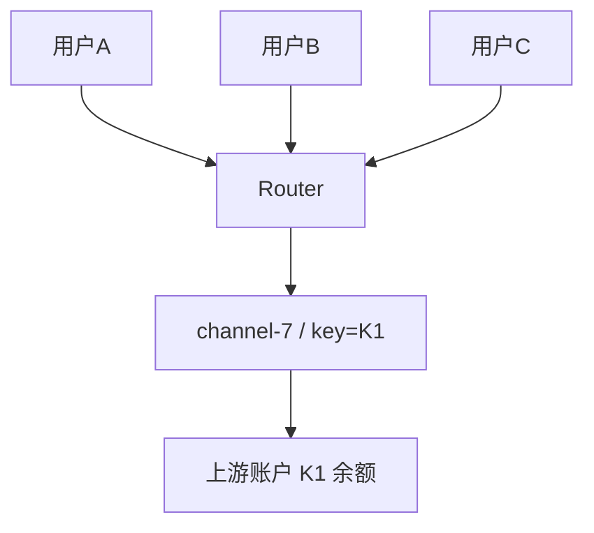

# Router 路由逻辑调研（基于当前源码）

> 调研时间：2026-02-13  
> 代码基线：`/root/code/router/router_new`

## 1. 入口与路由装配

- 启动入口：`cmd/router/main.go` -> `internal/app/app.go` 的 `Run()`。
- `Run()` 初始化 DB/Redis/Option/缓存后，创建 gin server 并注册全局中间件：
  - `gin.Recovery()`
  - `RequestId()`
  - `Language()`
  - `ApiLogger()`
  - session
- 之后 `router.SetRouter()` 继续挂载业务路由：
  - `SetApiRouter`：`/api/v1/public`、`/api`、`/api/v1/admin`、`/api/v1/internal`
  - `SetDashboardRouter`：`/dashboard/billing/*` 与 `/v1/dashboard/billing/*`
  - `SetRelayRouter`：OpenAI 兼容 `/v1/*`

## 2. OpenAI 兼容请求主链路（`/v1/*` 或 `/api/v1/public/*`）

## 3. 一个请求会经过几层？

以 `POST /v1/chat/completions` 为例，典型会经过 8 层：

1. 请求进入 gin server
2. 全局 middleware（`RequestId`、`Language`、`ApiLogger`、`CORS`）
3. `TokenAuth`（解析 JWT/UCAN/sk，并提取请求 model）
4. `Distribute`（按 user group + model 选 channel）
5. `Relay`（统一入口、重试/禁用控制）
6. `RelayTextHelper`（模型映射、预扣额度、调用 adaptor）
7. `adaptor.DoRequest`（拼接上游 URL + header）
8. `adaptor.DoResponse`（SSE/JSON 回写客户端）

## 4. 用户没额度会怎样？

### 4.1 文本/聊天/Responses

`RelayTextHelper` 的 `preConsumeQuota()` 会先检查用户额度：

- 通过 `CacheGetUserQuota(userId)` 读取额度。
- 若不足，直接返回：
  - HTTP `403`
  - code `insufficient_user_quota`
  - message `user quota is not enough`

这一步发生在真正调用上游之前，所以用户额度不足时通常不会打到上游。

### 4.2 token 没额度

- `TokenAuth` 阶段会先做 token 基础可用性校验（`ValidateUserToken`）。
- 文本/音频预扣阶段还会做 `PreConsumeTokenQuota`。
- 若 token 额度不足，会返回 `403`（`pre_consume_token_quota_failed`）。

## 5. 上游没额度会怎样？会不会自动换？

结论先说：

- 默认通常不会自动换。
- 即使配置了重试，也不保证一定能换成功。

### 5.1 重试开关默认值是 0

`config.RetryTimes` 默认 `0`。如果不在系统选项把 `RetryTimes` 调大，`Relay` 不会进入重试循环，因此不会切换渠道。

### 5.2 这些情况会强制不重试

`shouldRetry()` 明确：

- 请求若带 `SpecificChannelId`（例如管理员 `sk-<key>-<channelId>`），直接不重试。
- `400` 不重试。
- `2xx` 不重试。

### 5.3 即使重试，也可能“看起来没切换”

`Relay` 的重试是重新 `CacheGetRandomSatisfiedChannel(group, model, ignoreFirstPriority)`：

- 第一次重试仍在最高优先级池子里选。
- 若再次选到刚失败的 channel，会 `continue`，这次重试次数直接消耗掉。
- 后续轮次才可能下沉到低优先级（且受缓存路径影响）。

所以这些场景很容易表现为“没换”：

- 只有一个可用渠道。
- 重试次数太小（如 1）。
- 随机又抽到同一渠道。

### 5.4 自动禁用不等于本次请求立刻生效

`processChannelRelayError()` 是异步 `go` 协程。即使识别到 `insufficient_quota` 并 `DisableChannel`：

- 对当前请求的下一次重试不一定来得及生效。
- 若开启内存渠道缓存（Redis 场景常见），渠道缓存按周期同步，默认 `SYNC_FREQUENCY=600s`，禁用后的渠道可能短时间仍被选中。

### 5.5 上游额度不足会触发自动禁用吗？

仅当 `AutomaticDisableChannelEnabled=true` 时会触发。启用后若上游错误 `type` 命中 `insufficient_quota`（或 message 命中 `credit/balance` 等关键字）会自动禁用该渠道。

## 6. 典型时序：上游额度不足（你关心的场景）

假设 `chat/completions` 上游返回 `429 insufficient_quota`：

## 7. 额外观察（和“换路由体验”强相关）

1. `RelayImageHelper` 路径的上游错误处理与文本路径不同，重试/自动禁用行为不完全一致。
2. 代码中存在 `Proxy` 模式实现（`relaymode.Proxy` 与 proxy adaptor），但在当前 router 注册文件中未看到对应显式路由挂载。

## 8. 给你的直接答案

- “上游没额度报错会不会自动换？”
  - 源码结论：不一定，默认配置下大概率不会。
- 你实测“不会换”完全合理，常见根因：
  1. `RetryTimes` 仍是默认 `0`。
  2. 请求指定了 channel（`SpecificChannelId`），重试被直接关闭。
  3. 候选池没有可切目标，或重试次数/随机结果导致没切成。
  4. 自动禁用是异步且可能有缓存延迟，不保证“当次请求立刻避开坏渠道”。

## 9. 影响路由的因素（你问的“关联渠道/随机/负载”）

按一次请求真正生效的顺序看，主要是这些因素：

1. `SpecificChannelId`（是否强制指定渠道）
2. 请求里的 `model`
3. token 的模型白名单（`Token.Models`）
4. 用户分组（`user.group`）
5. 渠道是否启用（`channel.status = enabled`）
6. 渠道是否声明支持该 `group + model`（能力映射）
7. `priority`（先挑最高优先级层）
8. 同优先级内 `random` 随机挑一个
9. 失败后是否重试（`RetryTimes`、`shouldRetry` 条件）

## 10. 多个可用渠道时，是随机还是 round robin？

结论：当前是“随机”，不是 round robin。

- 在选路层没有“第 1 次走 A、第 2 次走 B”这类轮询计数器。
- 同优先级候选渠道采用随机（数据库 `RANDOM()/RAND()` 或内存 `rand.Intn`）。
- 因此连续两次命中同一渠道是正常现象，不存在“每 10 次固定轮转”。

## 11. “30个人用、一个人多次用”会怎么分配？

### 11.1 一个人每次是不是都随机？

是。路由按“请求”决策，不做用户会话粘性（sticky）。

### 11.2 多人并发会不会按负载自动均衡？

当前不会按实时负载均衡。源码里没有把这些量用于选路：

- 当前并发数（in-flight）
- 实时 QPS
- `weight` 字段（当前未用于选路）
- `response_time` 字段（主要来自测试记录，不参与分配）

系统只是在失败后做“重试+可能换路”，以及按错误触发自动禁用。

### 11.3 如果 3 个同优先级渠道，30 人各发 10 次（共 300 次）？

- 每次请求独立随机，单次命中每个渠道概率约 `1/3`。
- 期望上约是 `100/100/100`，但实际会有波动，不会精确平均。
- 所以你看到短时间某个渠道“更热”是正常随机波动，不代表轮询失效。

## 12. key 消耗为什么有时很快？（账号共享相关）

这里有两层“消耗”要区分：

1. Router 内部额度：`user quota` + `token quota`
2. 上游供应商额度：渠道配置的上游 API key/account 余额

### 12.1 一个 Router token（`sk-...`）多人共用

- 会共同消耗同一个 token 的 `remain_quota`。
- 也会共同消耗该 token 所属用户的 `user quota`。
- 因此“一个账号几个人用”会明显加快内部额度耗尽。

### 12.2 多个用户虽然 token 不同，但命中同一个 channel key

- 会共同消耗同一份上游账号余额。
- 若这个上游账号余额低，可能更快出现 `insufficient_quota`。

## 13. 高频请求时，“多久切一次渠道”？

- 不是按时间窗口切（不是每分钟或每 10 次固定切换）。
- 是“每个请求都重新选一次”。
- 若请求失败并允许重试，一个请求内部还会额外再选 1~N 次。

换句话说：切换频率取决于请求频率和失败重试，不是固定轮转节拍。
