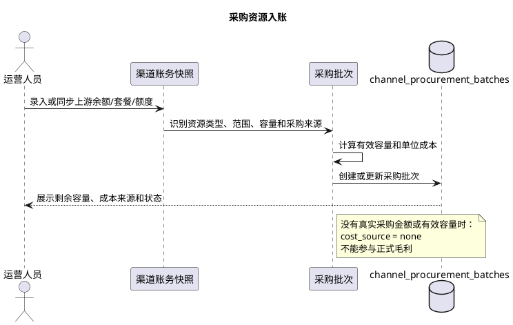
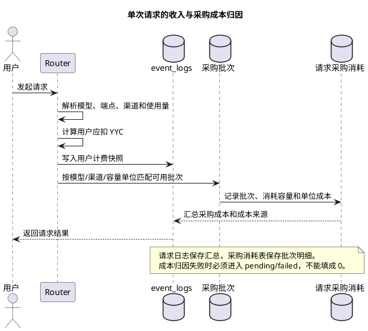
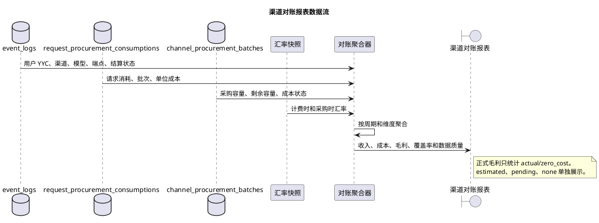

# 渠道采购与 YYC 对账方案

## 1. 目的

本文固定 Router 的渠道采购资源、用户侧 YYC 消耗和渠道级毛利对账口径。

对账需要同时回答：

1. 渠道从上游购买了什么资源。
2. Router 通过渠道向用户收取了多少 YYC。
3. 上游资源实际消耗了多少。
4. 本次消耗对应的真实采购成本是多少。
5. 套餐价格和 `group_channel.billing_ratio` 是否合理。

本文不改变现有套餐、分组、路由和计费逻辑，只固定分析口径。

## 2. 核心原则

YYC 是 Router 内部的用户消费和售价单位，不是真实财务成本单位。

因此必须同时保留：

- 采购原币种金额
- 采购成本 CNY
- Router 消耗 YYC
- 计费时 YYC / CNY 汇率快照
- 采购成本 YYC 等价

正式毛利以 CNY 为主要判断口径，YYC 用于套餐消耗、用户展示和运营对账。

业务边界固定为：

- 分组：技术可用范围
- 套餐：用户商业权益
- 模型价格：用户消费速度
- 渠道：路由和采购资源来源
- 采购批次：上游资源与真实成本
- 对账：用户收入与采购成本的比较

## 3. 金额口径

`billing_charge_amount` 表示本次从用户套餐或余额中扣除的 YYC。

用户收入等价金额使用计费时汇率：

`router_revenue_cny = billing_charge_amount / yyc_per_cny`

采购成本先按采购时汇率折算为 CNY：

`purchase_cost_cny = purchase_amount × purchase_fx_rate`

采购成本 YYC 等价只用于运营比较：

`procurement_cost_yyc = purchase_cost_cny × yyc_per_cny`

历史请求不能使用当前汇率覆盖原有汇率快照。

成本来源必须区分：

| 来源 | 含义 | 正式毛利 |
| --- | --- | --- |
| `actual` | 真实采购成本 | 参与 |
| `estimated` | 估算采购成本 | 单独展示 |
| `zero_cost` | 明确成本为 0 | 参与 |
| `none` | 没有成本配置 | 不参与 |
| `pending` | 等待成本归因 | 不参与 |

`none` 不能解释为零成本。

## 4. 采购批次和容量

采购资源按渠道进入资源桶，再按采购事件形成批次。当前建议使用 `channel_procurement_batches`。

批次至少需要表达：渠道、资源类型、范围、容量单位、总容量、有效容量、剩余容量、采购币种、采购金额、采购汇率、采购成本、单位成本、有效期、周期、成本来源和成本状态。

单位成本为：

`cost_per_unit_amount = purchase_cost_amount / capacity_effective`

不同资源使用不同容量单位：

| 资源 | 容量单位 |
| --- | --- |
| 余额 | `usd_equivalent`、`cny_equivalent` |
| 文本 | `token` |
| 图片 | `image`、`request` |
| 音频 | `second`、`minute`、`request` |
| 视频 | `second`、`video`、`task` |
| 按次资源 | `request` |

采购成本按实际消耗容量分摊，而不是在批次创建时一次性计入请求：

`request_procurement_cost = consumed_quantity × cost_per_unit_amount`

一个请求可以消耗多个批次，一个批次也可以被多个请求消耗，因此批次不能直接塞进消费日志。

## 5. 请求级成本快照

每个请求应该能回答：用户收了多少 YYC、收入等价多少 CNY、采购成本多少、来自哪些批次、毛利多少、命中了哪个渠道和模型。

`event_logs` 保存请求级汇总；`request_procurement_consumptions` 保存批次明细。

请求级汇总至少包括：

- 官方价格锚点和币种
- 官方价格锚点 CNY
- 采购成本 CNY
- 采购成本来源和置信度
- 用户售价 CNY
- 毛利和毛利率
- 计价规则版本和成本规则版本

毛利公式：

`gross_profit_cny = revenue_cny - procurement_cost_cny`

`gross_margin = gross_profit_cny / revenue_cny`

采购成本来源为 `none` 或 `pending` 时，不计算正式毛利，也不把成本当成 0。

## 6. 渠道对账报表

最低按以下维度查询：时间周期、渠道、供应商、模型、端点、分组、资源类型、容量单位、成本来源和结算真值模式。

核心指标：

- Router 消耗 YYC
- Router 收入等价 CNY
- 采购消耗成本 CNY
- 采购成本 YYC 等价
- 毛利 CNY
- 毛利率
- 成本覆盖率
- 请求数
- `actual`、`estimated`、`pending`、`none` 请求数

建议提供三种视图：

1. 采购资源视图：采购金额、容量、剩余量、单位成本和有效期。
2. Router 消费视图：渠道、模型、端点、请求数、YYC、收入 CNY、套餐/余额消费。
3. 毛利对账视图：收入、采购成本、毛利、毛利率、成本覆盖率和成本来源分布。

## 7. 数据质量检查

至少检查：

1. 已消耗容量大于有效容量。
2. 批次有剩余容量但没有单位成本。
3. 请求有 Router 消费但没有采购成本归因。
4. 采购成本已归因但找不到消费日志。
5. 同一请求重复消耗同一批次。
6. 过期、禁用或耗尽批次仍被新请求消耗。
7. Router 收入为正但成本来源全部为 `none`。
8. 采购成本为正但 Router 收入快照缺失。

数据质量问题不能通过报表默认填 0 解决，必须保留异常状态。

## 8. 套餐和倍率

`yyc_quota` 适合表达“一笔 YYC 消费预算在分组内按模型价格消耗”。这是混合模型分组最稳妥的套餐形态。

`request_quota` 适合成本接近的模型集合。不建议一个按次套餐无差别覆盖普通文本、高价 reasoning、图片、音频和视频模型；如必须混合，应增加模型等级、请求系数或模型范围限制。

当前 `group_channel.billing_ratio` 会参与用户最终扣费。同一个模型因路由命中不同渠道时，用户价格可能不同。对账必须同时展示用户售价、命中渠道、渠道倍率、供应商价格、采购成本和毛利。

中期应评估将用户售价稳定到 `group + model + endpoint`，将渠道差异更多用于采购成本和路由决策。

## 9. 落地顺序

### 第一阶段：只读对账

不改变线上扣费和套餐规则：

1. 按渠道、模型、端点聚合 Router 消费。
2. 按采购批次聚合容量和采购成本。
3. 同时输出 YYC、CNY 和原币种金额。
4. 区分 `actual`、`estimated`、`none`、`pending`。
5. 增加数据质量检查。

### 第二阶段：修正成本数据

补齐真实采购成本，修正容量单位和有效容量，增加批次并发锁、请求幂等和成本归因失败重试。

### 第三阶段：稳定售价

基于对账数据评估是否继续让渠道倍率直接影响售价、是否将售价收敛到 `group + model + endpoint`，以及哪些模型和按次套餐需要拆分。

### 第四阶段：启用成本底线

真实成本覆盖率和归因稳定后，才灰度启用 `selected_sell = max(official_sell, cost_floor)`。

## 10. 结论

“套餐绑定分组、按模型实际消耗 YYC”的方向可以继续，但必须固定：分组负责技术范围，套餐负责商业权益，模型价格决定 YYC 消耗速度，渠道提供路由和采购资源，采购批次提供真实成本，对账层比较用户收入和采购成本。

在对账数据稳定之前，不建议直接修改套餐价格、扩大按次套餐模型范围或提高利润倍率。

## 11. 方案 Review 结论

### 11.1 方向正确，但不能只对比两个 YYC 数字

“上游采购额度和 Router 消耗额度都换算为 YYC”适合作为运营对账视图，但不适合作为唯一的财务事实。

必须同时维护三套账：

| 账本 | 事实 | 主要单位 | 用途 |
| --- | --- | --- | --- |
| 采购资源账 | 买了多少资源、还剩多少 | 原币种、容量单位 | 资源管理 |
| 用户收入账 | 用户实际支付多少 | YYC、CNY 等价 | 套餐和收入 |
| 成本归因账 | 请求消耗了哪些采购批次 | CNY、容量单位 | 毛利和保本 |

只有三套账按同一渠道、模型、端点和时间周期对齐后，才可以判断定价是否合理。

### 11.2 CNY 是经营判断主口径，YYC 是运营比较口径

不能因为 Router 内部使用 YYC，就把 YYC 当作真实成本货币。

推荐规则：

- 用户额度和套餐消耗展示使用 YYC。
- 采购成本保留原币种，并折算为 CNY。
- 历史收入和成本使用各自发生时的汇率快照。
- 正式毛利、毛利率和采购成本底线使用 CNY 判断。
- 采购成本 YYC 等价只作为运营辅助字段。

### 11.3 “采购额度”与“采购成本”不能混为一谈

上游购买的额度是容量，采购成本是获得这批容量支付的金额。

例如：

```text
采购金额：720 CNY
采购容量：1,000,000 token
单位成本：0.00072 CNY/token
```

不能直接把 720 CNY 等同于某次请求的成本。请求必须先消耗容量，再按单位成本分摊金额。

如果只有上游余额，没有可确认的购买金额和容量，就只能记录账务快照，不能自动推导真实采购成本。

## 12. 推荐数据流

### 12.1 采购入账流



### 12.2 请求消费与成本归因



### 12.3 对账报表流



## 13. 对账公式和时间口径

### 13.1 收入

用户侧收入必须以最终实际扣除的 YYC 为准，而不是预扣金额：

```text
router_revenue_yyc = sum(final_billing_charge_amount)
router_revenue_cny = sum(final_billing_sell_base_amount)
```

如果请求最终发生回补或补扣，报表只能使用最终结算结果，不能同时把预扣和实扣计入收入。

### 13.2 采购成本

```text
procurement_cost_cny
  = sum(consumed_quantity × unit_cost_amount)
```

一个请求跨多个批次时：

```text
request_cost_cny = sum(all request_procurement_consumptions)
```

### 13.3 毛利

```text
gross_profit_cny = router_revenue_cny - procurement_cost_cny
gross_margin = gross_profit_cny / router_revenue_cny
```

当请求没有真实采购成本时，应输出“成本未完成”或“成本未配置”，不能输出虚假的正毛利。

### 13.4 统计周期

报表必须区分：

- 采购批次创建时间。
- 采购资源生效时间。
- 请求发生时间。
- 请求最终结算时间。
- 成本归因完成时间。

经营对账建议按请求最终结算时间统计收入和消耗，按采购批次有效时间判断成本可用性。成本归因完成时间只用于解释延迟和重试，不应改变请求发生周期。

## 14. 并发、幂等和状态机要求

采购批次消耗不是普通报表写入，必须满足以下约束：

1. 同一 `request_log_id` 不能重复产生相同批次和容量单位的消耗。
2. 并发请求消耗同一批次时，剩余容量不能被超卖。
3. 批次消耗和请求消耗记录必须具有可追踪的事务边界。
4. 请求失败时，不能留下已经计入正式成本但没有有效请求日志的孤立消耗。
5. 成本归因失败需要可重试，重试不能重复扣减批次。

建议的成本归因状态：

```text
pending -> actual
pending -> estimated
pending -> none
pending -> failed
failed  -> pending
```

`actual`、`estimated`、`none` 和 `failed` 都是最终解释状态；`pending` 允许报表显示但不允许进入正式毛利。

## 15. 定价和倍率评估方法

不要直接看某个渠道的总毛利决定倍率，应按以下顺序定位：

1. 先看模型级毛利，确认是否某个高成本模型拖累整体。
2. 再看端点级毛利，确认是否图片、音频或视频单位映射错误。
3. 再看采购批次级成本，确认是否采购成本录入错误。
4. 再看路由级分布，确认是否大量请求被导向高成本渠道。
5. 最后才调整 `group_channel.billing_ratio` 或模型售价。

推荐同时查看：

```text
实际用户售价 / 采购成本
真实成本覆盖率
actual 成本覆盖率
估算成本占比
待归因请求占比
渠道切换后的价格差异
```

只有当 `actual` 覆盖率足够高、待归因比例稳定且批次容量可信时，毛利率才适合用来调整售价。

## 16. 评审后的实施顺序

1. 先完成只读渠道对账报表，不改变扣费。
2. 补采购批次的真实成本、容量单位和有效容量。
3. 增加批次消耗的事务锁、幂等和失败重试。
4. 将 `none`、`pending`、`estimated` 从正式毛利中严格隔离。
5. 观察模型、端点和渠道级毛利，而不是只看分组总毛利。
6. 评估 `group_channel.billing_ratio` 是否导致同一模型跨渠道价格不稳定。
7. 评估按次套餐是否覆盖成本差异过大的模型。
8. 最后才灰度启用 `selected_sell = max(official_sell, cost_floor)`。

在第 1 至第 5 步完成前，不建议直接调整套餐价格、扩大按次套餐范围或提高利润倍率。
