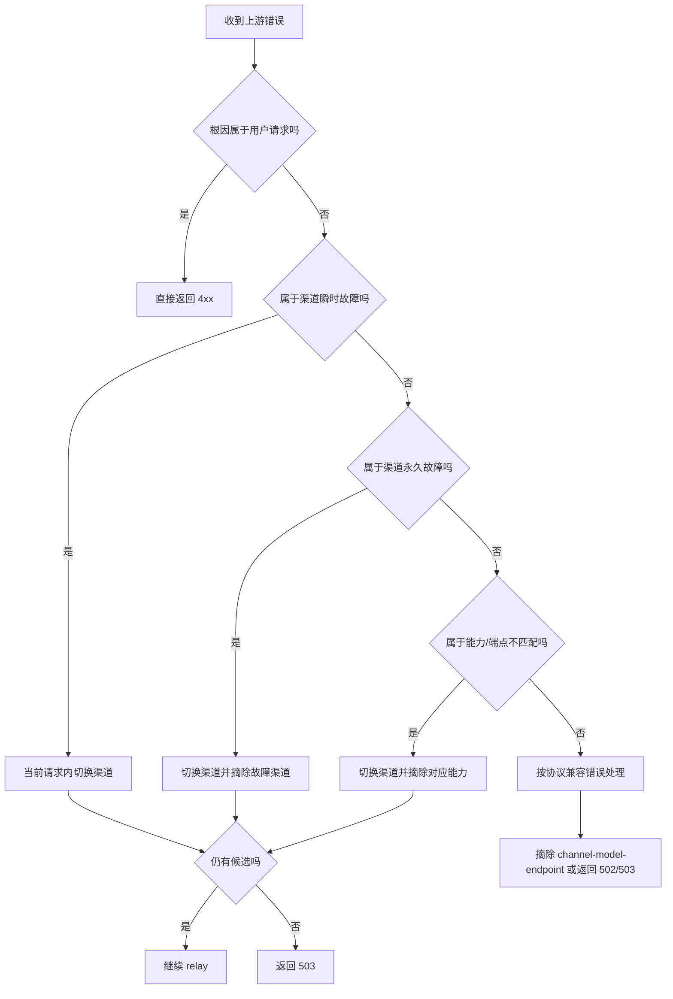

# 渠道错误处理策略

本文档描述 Router 面向上游渠道错误的目标处理策略。

它回答两个问题：

1. 上游报错时，应该把它归到哪一类。
2. 每一类错误，Router 最佳的处理动作是什么。

本文档不是当前实现基线；当前真实行为请看 [路由逻辑](./路由逻辑.md)。

## 1. 核心结论

1. 客户端看到的 `429`，应尽量只表示 Router 自身或租户自身真的被限流，不应直接暴露“某一个上游渠道返回了 429”。
2. 单个上游渠道的 `429`、`5xx`、超时，本质上是“渠道候选失效”，Router 应先在内部切换渠道，而不是立即把错误抛给客户端。
3. 余额不足、鉴权失败、账号停用，属于“渠道永久性故障”，应立即切换，并把故障渠道从后续候选池中摘除。
4. 模型不存在、模型无权限、端点不支持，不应一刀切禁用整个渠道，更适合下沉到 `channel_model` 或 `channel_model_endpoints` 这一层处理。
5. 用户请求本身非法、内容安全拒绝，不应切换渠道；这类错误应直接返回给客户端。
6. `Codex` 或其他客户端的外层重试只能作为补充，不能替代 Router 的请求内故障转移。

## 2. 分类原则

先判断错误根因属于哪一侧：

| 归属侧 | 典型含义 | Router 主动作 |
| --- | --- | --- |
| 用户请求侧 | 请求体非法、参数冲突、内容安全命中 | 直接返回，不切换 |
| 渠道瞬时状态侧 | 限流、过载、网关异常、超时 | 当前请求内切换 |
| 渠道永久状态侧 | 余额不足、无效 key、账号停用 | 当前请求内切换 + 摘除渠道 |
| 渠道能力配置侧 | 模型无权限、模型不存在、端点不支持 | 当前请求内切换 + 摘除能力，不一定摘除整条渠道 |
| 协议兼容侧 | 上游返回格式异常、Router 构造请求与供应商协议不匹配 | 按 `channel + model + endpoint` 维度隔离，必要时返回 `502/503` |

## 3. `error.type` / `error.code` 字段说明

这些字段目前有明确含义，但不是一套完全统一、完全受 Router 控制的全局枚举。

要点只有两个：

1. 有一部分值来自上游原样透传。
2. 另一部分值是 Router 自己包装出来的兜底值。

因此，当前不应把 `type/code` 当成严格稳定的内部协议常量，只能当成“错误分类线索”。

### 3.1 `type` 含义表

| `type` | 来源 | 典型含义 | 说明 |
| --- | --- | --- | --- |
| `one_api_error` | Router 本地包装 | Router 自己在本地校验、转换、派发、计费时构造的错误 | 例如 `do_request_failed`、`convert_request_failed`、`model_pricing_not_configured` |
| `upstream_error` | Router 兜底包装 | 已经是上游错误，但上游响应体无法按标准结构解析，或 Router 只能给一个兜底类型 | 例如 `bad_response`、`bad_response_status_code` |
| `invalid_request_error` | 通常是 OpenAI 风格；可能来自上游，也可能由 Router 在兼容接口中主动构造 | 请求参数不合法、模型不存在、URL 不合法 | 需要结合 `code` 和场景看，不能只看 `type` |
| `authentication_error` | 通常来自上游 | key 无效、认证失败 | 常用于渠道永久性故障判断 |
| `permission_error` | 通常来自上游 | 模型或资源无权限 | 更偏能力问题，不一定该禁用整条渠道 |
| `forbidden` | 通常来自上游 | 访问被禁止 | 可能是权限，也可能是账号状态 |
| `insufficient_quota` | 通常来自上游 | 余额不足或额度耗尽 | 更偏渠道永久性故障 |
| `content_policy_violation` | 通常来自上游 | 内容安全拒绝 | 更偏用户请求侧问题，不应切换渠道 |

### 3.2 `code` 含义表

| `code` | 来源 | 典型含义 | 当前用途 |
| --- | --- | --- | --- |
| `do_request_failed` | Router 本地包装 | 发起上游 HTTP 请求失败，常见于超时、连接错误、TLS 错误 | 应视为瞬时性上游故障线索 |
| `convert_request_failed` | Router 本地包装 | Router 在请求桥接或格式转换时失败 | 本地错误，不应当成上游渠道过载 |
| `model_pricing_not_configured` | Router 本地包装 | 定价配置缺失 | 本地配置错误 |
| `invalid_api_type` | Router 本地包装 | 渠道协议或适配器类型不正确 | 本地配置错误 |
| `bad_response` | Router 兜底包装 | 上游响应对象为空或异常 | 上游异常兜底 |
| `bad_response_status_code` | Router 兜底包装 | 上游返回了非成功状态，但无法提取更明确的标准错误码 | 上游异常兜底 |
| `invalid_api_key` | 通常来自上游 | key 无效 | 常用于自动禁用渠道 |
| `account_deactivated` | 通常来自上游 | 账号被停用 | 常用于自动禁用渠道 |
| `model_not_found` | 常见于 OpenAI 风格错误，也可能由 Router 在模型查询接口主动构造 | 模型不存在 | 更偏能力或请求问题，不一定该禁用整条渠道 |
| 空字符串或非标准字符串 | 上游透传或 Router 兼容构造 | 没有稳定枚举，需结合 `status/message/type` 一起判断 | 当前实现中很常见 |

## 4. 总图

## 5. 分类矩阵

| 错误类别 | 常见上游表现 | 根因归属 | 当前请求内切换 | 自动摘除 | 建议对客户端最终状态 | 是否值得依赖客户端外层重试 | 最佳处理策略 |
| --- | --- | --- | --- | --- | --- | --- | --- |
| 用户请求无效 | `400 invalid_request_error`、参数缺失、JSON 非法、上下文超长 | 用户请求侧 | 否 | 否 | `400` 或 `422` | 否 | 直接返回，保留尽量准确的错误信息，不消耗渠道切换次数 |
| 内容安全拒绝 | `400/403 content_policy_violation`、审核拒绝 | 用户请求侧 | 否 | 否 | `400` 或 `403` | 否 | 直接返回，不切换渠道，因为换渠道通常也不会改变结论 |
| 上游限流 / 瞬时过载 | `429 rate_limit_exceeded`、`429 overloaded`、供应商网关提示过载 | 渠道瞬时状态侧 | 是 | 否，先不要立即禁用整条渠道 | 候选耗尽后返回 `503` | 低，只能补充 | 先在 Router 内切换其他候选；若全部候选都失败，再统一返回 `503`，不要把单渠道 `429` 直接暴露给客户端 |
| 上游临时不可用 / 网关异常 / 超时 | `5xx`、`EOF`、`i/o timeout`、TLS 握手失败、连接重置 | 渠道瞬时状态侧 | 是 | 否，按阈值熔断 | 候选耗尽后返回 `503` | 低，只能补充 | 视为临时性渠道故障，优先切换；若同一渠道持续失败，再进入窗口熔断 |
| 鉴权失败 / 账号停用 | `401`、`invalid_api_key`、`authentication_error`、`account_deactivated` | 渠道永久状态侧 | 是 | 是，按渠道维度摘除 | 候选耗尽后返回 `503` | 否 | 当前请求立即改走其他渠道，同时自动禁用该渠道，等待人工修复或自动恢复 |
| 余额不足 / 配额耗尽 | `insufficient_quota`、`credit balance is too low`、`balance`、`已欠费` | 渠道永久状态侧 | 是 | 是，按渠道维度摘除 | 候选耗尽后返回 `503` | 否 | 不应把某一家上游余额不足直接暴露给客户端；应先切换，且把故障渠道移出后续候选池 |
| 模型无权限 / 模型不存在 | `model_not_found`、`permission_error`、模型未开通 | 渠道能力配置侧 | 是 | 是，但优先摘除 `channel_model` / `group_model_channels` 能力，不一定禁用整条渠道 | 候选耗尽后返回 `503` | 否 | 说明这条渠道不适合承载该模型，应下沉到模型能力层修正，而不是直接误伤渠道其他模型 |
| 端点不支持 / 模态不支持 | `404 route not found`、`unsupported endpoint`、图片/音频/视频端点未开通 | 渠道能力配置侧 | 是 | 是，按 `channel + model + endpoint` 维度摘除 | 候选耗尽后返回 `503` | 否 | 这是能力匹配问题，不是整条渠道不可用；应把错误沉淀到端点能力维度 |
| 协议或响应格式不兼容 | 返回结构无法解析、字段类型不符、Router 桥接后被供应商拒绝 | 协议兼容侧 | 视情况 | 是，优先按 `channel + model + endpoint` 维度隔离 | 更偏向 `502`，若已尝试切换且无候选可用则 `503` | 低 | 先判定是单供应商兼容问题还是 Router 共性构造问题；单供应商问题应局部摘除，共性问题应尽快修复桥接逻辑 |

## 6. 状态码归一化建议

目标不是“把所有上游状态码原样透传”，而是让客户端看见更稳定、更符合语义的结果。

| 场景 | 建议返回 |
| --- | --- |
| 用户请求错误 | `400/422` |
| 内容安全或权限拒绝 | `403` 或上游明确的 `4xx` |
| 单渠道 `429/5xx/timeout`，Router 内部已切换成功 | 不暴露错误，直接返回成功 |
| 多个候选都因瞬时性问题失败 | `503` |
| 多个候选都因永久性渠道问题不可用 | `503` |
| 上游协议格式异常，Router 无法正确解析 | `502` 更合适；若已进行候选切换且整体无可用能力，也可返回 `503` |

关键原则：

1. `429` 不应继续作为“某个上游渠道负载已满”的直接外显状态。
2. 对客户端而言，只要请求本身是合法的，而失败原因在 Router 候选池内部，最终都更适合收敛为 `503`。
3. `503` 表达的是“当前没有可用上游能力”，这比把单渠道 `429` 或余额不足直接抛给客户端更稳定。

## 7. 对客户端重试的定位

客户端重试可以保留，但定位必须降级为“补充机制”。

| 场景 | 是否应依赖客户端重试 | 原因 |
| --- | --- | --- |
| 单渠道瞬时限流 | 不应主要依赖 | Router 更接近候选池，应该先做内部切换 |
| 多个渠道同时瞬时失败 | 可以补充 | `503` 适合让客户端稍后再试 |
| 单渠道余额不足 / key 失效 | 不应依赖 | 客户端重试不会修复坏渠道，Router 应先摘除 |
| 用户请求错误 | 不应依赖 | 重试没有意义 |

对 `Codex` 这类客户端，最关键的一点是：

- 不要把“上游单渠道 `429`”包装成“Router 自己 `429`”。
- Router 应先承担候选池内部故障转移职责。
- 只有当候选池整体不可用时，才向客户端返回 `503`，让客户端决定是否做更外层的退避重试。

## 8. 建议的落地顺序

1. 先修正最终状态码归一化

- 上游单渠道 `429/5xx/timeout` 在候选耗尽后统一收敛到 `503`。
- 不再把单渠道 `429` 直接作为客户端最终状态。

2. 再优化优先级层内穷举与降级策略

- 当前已支持“同一次请求内排除已失败渠道”。
- 当前也已支持“优先尝试未失败的最高优先级层，层耗尽后自动降级到下一层”。
- 后续可继续补充更细的重试日志与观测指标，例如记录命中第几优先级层、该层剩余候选数。

3. 当前能力级摘除已经分成两层

- `模型不存在 / 明显的模型权限不足` 下沉到 `channel_model` 维度。
- `端点不支持 / 模态不支持` 下沉到 `channel_model_endpoints` 维度。
- 后续重点不再是“补端点级摘除”，而是给这两层摘除增加更好的观测、恢复与熔断策略。

4. 最后补窗口熔断

- 对持续 `429/5xx/timeout` 的渠道，增加失败窗口与自动恢复策略。
- 让“瞬时错误”和“永久错误”走不同的摘除路径。
