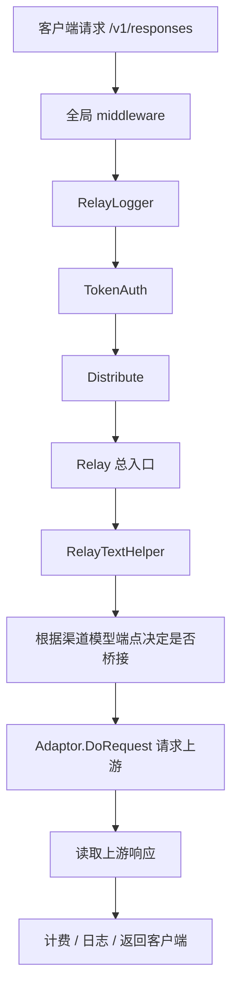
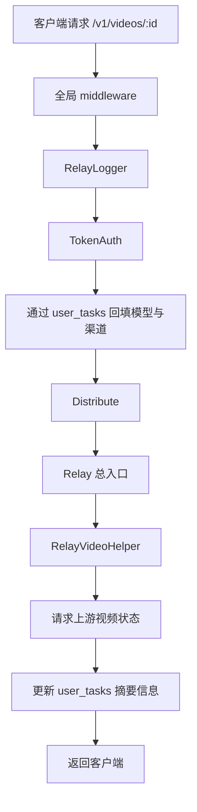

# Router 路由逻辑

本文档描述当前代码中的真实路由基线，用于回答三个问题：

1. 请求从哪里进入系统
2. 不同路径分别走哪条处理链路
3. 路由、鉴权、选路、任务模型之间的边界是什么

当前版本的接口定义、路由装配和任务分层，均以本文档为准。
如需核对精确路径细节，可同时参考：

- [接口文档](./接口文档.md)
- `docs/swagger/openapi.json`

## 文档信息

- 最后核对日期：2026-03-12
- 适用范围：当前 `main` 分支代码
- 主要对应目录：
  - `internal/app`
  - `internal/transport/http/router`
  - `internal/transport/http/middleware`
  - `internal/admin/controller`
  - `internal/relay`
  - `internal/admin/model`

## 1. 启动入口与路由装配

启动入口：

- `cmd/router/main.go`
- `internal/app/app.go:Run()`

服务启动时的关键步骤：

1. 初始化基础环境

- `common.Init()`
- 日志初始化
- i18n 初始化

2. 初始化数据层

- 主库 `model.InitDB()`
- 日志库 `model.InitLogDB()`
- 默认 Root 账户引导已停用
- OptionMap 初始化
- 渠道缓存初始化与同步

3. 初始化后台异步任务工作器

- 仅在 `config.IsMasterNode` 时启动
- 入口：`internal/admin/controller/task.StartAsyncTaskWorkers()`
- 当前系统异步任务底层表为：`admin_tasks`

4. 初始化 HTTP Server

- `gin.New()`
- 全局中间件：
  - `gin.Recovery()`
  - `middleware.TraceID()`
  - `middleware.Language()`
  - `middleware.SetUpLogger(server)`
  - session middleware

5. 注册路由

- `router.SetRouter(server, rootapp.BuildFS)`

## 2. 顶层路由分层

当前系统有四类核心 HTTP 路由层：

1. 页面与静态资源

- 前端管理台与用户工作区页面
- 由 `router.SetRouter(...)` 统一装配

2. Public API

- 前缀：`/api/v1/public`
- 用于用户工作区、公共信息、用户自助管理、OpenAI 兼容代理入口

3. Admin API

- 前缀：`/api/v1/admin`
- 用于后台管理、渠道管理、供应商管理、分组管理、系统任务管理、用户任务查看

4. Relay API

- 前缀：`/v1`
- 用于对外直接提供 OpenAI 兼容接口

一句话概括：

- `/api/v1/public/*` 更偏“站内接口”
- `/v1/*` 更偏“标准 OpenAI 兼容入口”
- 两者的中继链路最终会汇入相同的 relay 能力

## 3. 当前路由装配结构

### 3.1 Public API

定义文件：

- `internal/transport/http/router/api.go`

主要分组：

1. 公开认证

- `/api/v1/public/common/auth/*`
- `/api/v1/public/auth/*`

2. 用户自助接口

- `/api/v1/public/user/*`
- 包括：`self`、`dashboard`、`spend/overview`、`available_models`、`tasks` 等

3. 用户 Token 管理

- `/api/v1/public/token/*`

4. 用户日志

- `/api/v1/public/log/*`

5. 用户可见模型目录

- `/api/v1/public/channel/models`

6. Public OpenAI 兼容模型列表

- `/api/v1/public/models`

7. Public Relay

- `/api/v1/public/chat/completions`
- `/api/v1/public/responses`
- `/api/v1/public/images/generations`
- `/api/v1/public/audio/*`
- `/api/v1/public/videos`
- `/api/v1/public/videos/:id`

Public relay 使用的中间件链：

- `RelayLogger()`
- `TokenAuth()`
- `Distribute()`

### 3.2 Admin API

定义文件：

- `internal/transport/http/router/api.go`

主要分组：

1. 用户管理

- `/api/v1/admin/user/*`
- 当前也包含管理员查看用户任务：
  - `GET /api/v1/admin/user/tasks`
  - `GET /api/v1/admin/user/tasks/:id`
- 额外权限边界：
  - 基础用户管理对管理员开放
  - 当前登录用户的钱包地址命中 `bootstrap.root_wallet_address` 时，才可处理管理员账户本身
  - `bootstrap.root_wallet_address` 支持多个地址，使用英文逗号分隔
  - 若该配置为空，则管理员仍可管理普通用户，但不能删除其他管理员或修改其他管理员角色

2. 系统配置

- `/api/v1/admin/option/*`

3. 渠道管理

- `/api/v1/admin/channel/*`
- `/api/v1/admin/channels`

4. 系统任务管理

- `/api/v1/admin/tasks/*`
- 当前底层表：`admin_tasks`

5. 分组管理

- `/api/v1/admin/group/*`
- `/api/v1/admin/groups`

6. 供应商管理

- `/api/v1/admin/providers/*`

7. 日志、兑换码等后台模块

- `/api/v1/admin/log/*`
- `/api/v1/admin/redemption/*`

Admin API 主要使用的鉴权中间件：

- `AdminAuth()`
- `RootAuth()`

### 3.3 Relay API

定义文件：

- `internal/transport/http/router/relay.go`

主要提供标准兼容入口：

- `GET /v1/models`
- `POST /v1/chat/completions`
- `POST /v1/responses`
- `POST /v1/images/generations`
- `POST /v1/audio/*`
- `POST /v1/videos`
- `GET /v1/videos/:id`

Relay `/v1/*` 使用的中间件链与 Public relay 一致：

- `RelayLogger()`
- `TokenAuth()`
- `Distribute()`

## 4. 鉴权与上下文写入

### 4.1 Session/JWT/Admin 权限

后台页面和用户工作区接口走的是：

- `UserAuth()`
- `AdminAuth()`
- `RootAuth()`

它们的共同入口在：

- `internal/transport/http/middleware/auth.go`

能力包括：

- Session 登录态识别
- Wallet JWT 识别
- Access token 识别
- 用户状态校验
- 角色校验

补充说明：

- 当前系统对外不再依赖“默认 root 账号”。
- 系统级用户管理权限来自 `bootstrap.root_wallet_address`。
- 命中该配置的钱包用户，在鉴权阶段会被提升为内部有效角色 `RoleRootUser`，用于通过“管理员账户操作”权限校验。
- 但对前端返回的用户信息会收敛为普通“管理员”角色，并通过 `can_manage_users=true` 单独表达“可管理用户”能力。

### 4.2 TokenAuth

中继接口统一走：

- `TokenAuth()`

它负责：

1. 解析令牌来源

- 钱包 JWT
- 普通访问令牌

2. 提取请求模型

- 从请求体或 URL 中取模型名
- 写入 `ctxkey.RequestModel`

3. 校验令牌可用模型范围

- `ctxkey.AvailableModels`

4. 写入用户与 token 上下文

- `ctxkey.Id`
- `ctxkey.TokenId`
- `ctxkey.TokenName`

5. 处理视频状态查询的任务上下文回填

- 当请求是 `GET /v1/videos/:id` 或 `GET /api/v1/public/videos/:id`
- 会通过 `user_tasks` 中的任务记录回填：
  - 模型名
  - 指定渠道 ID

这一步的意义是：

- 视频状态查询通常只有 task id
- Router 需要借助任务记录把请求重新路由回原来的模型与渠道

## 5. 选路中间件 `Distribute`

定义文件：

- `internal/transport/http/middleware/distributor.go`

作用：

1. 根据请求模型、用户分组、令牌模型范围等信息
2. 选择一个可用渠道
3. 把选路结果写入上下文，供 relay controller 使用

当前选路的主要影响因素：

1. `SpecificChannelId`

- 如果请求上下文里已经指定渠道，优先走指定渠道

2. 请求模型

- 来自 `ctxkey.RequestModel`

3. 用户分组

- 影响可选渠道范围

4. 渠道状态

- 仅选择可用渠道

5. 渠道模型配置

- 是否支持当前模型
- 对应的上游模型名、端点、类型、价格信息

6. 优先级与随机

- 先选最高优先级层
- 同优先级内随机选择

当前不是 round robin，也不是按实时负载均衡。

## 6. Relay 总入口

定义文件：

- `internal/admin/controller/relay.go`

Router 不同模态最终都会汇入统一的 `Relay` 分发入口，然后根据路径决定调用哪个 helper。

当前主要分支：

- 文本：`RelayTextHelper`
- 图片：`RelayImageHelper`
- 音频：`RelayAudioHelper`
- 视频：`RelayVideoHelper`

路径到 relay mode 的判断定义在：

- `internal/relay/relaymode/helper.go`

其中已支持：

- `/v1/chat/completions`
- `/v1/responses`
- `/v1/images/generations`
- `/v1/audio/*`
- `/v1/videos`
- `/v1/videos/:id`

## 7. 文本链路与端点协商

定义文件：

- `internal/relay/controller/text.go`
- `internal/admin/model/channel_model.go`
- `internal/relay/adaptor/openai/bridge.go`

当前文本模型的核心规则：

1. 渠道模型端点优先表达“上游真实支持什么”

- 典型值：
  - `/v1/responses`
  - `/v1/chat/completions`

2. 如果上游配置为 `/v1/responses`

- 下游发 `/v1/chat/completions`
  - Router 负责桥接到 `/v1/responses`
- 下游发 `/v1/responses`
  - Router 透传到 `/v1/responses`

3. 如果上游不支持 `/v1/responses`

- 下游发 `/v1/responses`
  - 直接拒绝
- 不会伪装成 chat 再继续发给不支持 responses 的上游

4. `/v1/responses` 请求体的处理原则

- 不做大规模重建
- 只做必要规范化
- 当前重点是把 `input` 统一成 array 语义
- 其他未知字段尽量保留原样

这套规则同时用于：

- 实际 relay
- 后台渠道模型测试

## 8. 图片、音频、视频链路

### 8.1 图片

图片当前已支持：

- `/v1/images/generations`

图片链路参与复杂计费：

- 可按 `quality + size` 命中 `provider_model_price_components`

### 8.2 音频

音频当前已支持：

- `/v1/audio/transcriptions`
- `/v1/audio/translations`
- `/v1/audio/speech`

音频复杂计费当前按：

- `audio_input`
- `audio_output`

做区分。

### 8.3 视频

视频当前已支持：

- `POST /v1/videos`
- `GET /v1/videos/:id`
- `POST /api/v1/public/videos`
- `GET /api/v1/public/videos/:id`

定义文件：

- `internal/relay/controller/video.go`
- `internal/relay/model/video.go`

当前视频链路已经具备：

1. 创建任务

- 透传视频生成请求到上游

2. 查询任务状态

- 通过 task id 查询视频状态

3. 记录用户侧任务

- 视频任务写入 `user_tasks`
- 当前 `user_tasks` 用于用户可见的业务任务

4. 计费

- 视频链路已经接入运行时计费
- 支持 `video_generation` 价格组件匹配

5. 日志补充

- 会记录视频 task id、状态、结果地址、request id 等摘要信息

## 9. 任务模型分层

当前任务分成两类，不再混用：

### 9.1 系统任务 `admin_tasks`

底层表：

- `admin_tasks`

对应接口：

- `GET /api/v1/admin/tasks`
- `GET /api/v1/admin/tasks/:id`
- `POST /api/v1/admin/tasks/:id/cancel`
- `POST /api/v1/admin/tasks/:id/retry`

当前主要承载：

- 渠道模型测试
- 渠道刷新模型
- 渠道刷新余额

这些任务由后台 worker 执行。

### 9.2 用户任务 `user_tasks`

底层表：

- `user_tasks`

对应接口：

- 用户侧：
  - `GET /api/v1/public/user/tasks`
  - `GET /api/v1/public/user/tasks/:id`
- 管理员侧：
  - `GET /api/v1/admin/user/tasks`
  - `GET /api/v1/admin/user/tasks/:id`

当前主要承载：

- 视频业务任务

这类任务的目标不是后台调度系统任务，而是给用户和管理员提供“业务任务可见性”。

## 10. 请求从进入到上游的大致链路

以 `POST /v1/responses` 为例：

以 `GET /v1/videos/:id` 为例：

## 11. 当前重试与自动切换的真实边界

这部分是当前实现中的真实行为，不是理想行为。

1. 默认不会保证自动切换成功

- 是否重试，受 `RetryTimes` 和错误类型影响

2. 指定渠道时通常不会重试

- 例如显式指定某个渠道

3. 同优先级是随机，不是轮询

- 所以重试时可能再次抽到同一渠道

4. 自动禁用不保证对“当前请求”立即生效

- 禁用与缓存更新存在时序差

因此：

- “上游报错后会不会自动换路由”
- 当前答案仍然是：不一定

## 12. 当前应以什么文档为准

如果需要理解“系统怎么跑”，看本文档。

如果需要看“某个接口的精确路径、参数、返回”，优先看：

1. [接口文档](./接口文档.md)
2. `docs/swagger/openapi.json`

如果需要看“价格与复杂计费规则”，看：

1. [定价模型设计](./定价模型设计.md)
2. [复杂计费条件规范](./复杂计费条件规范.md)
