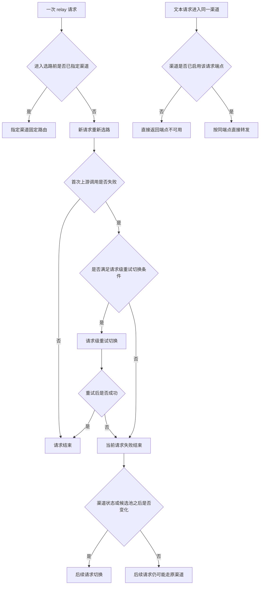
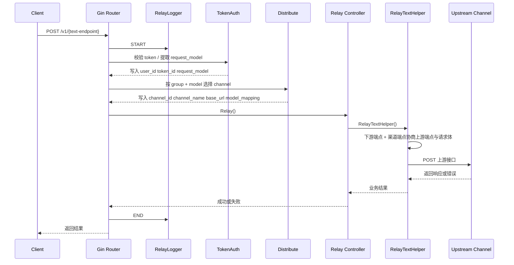
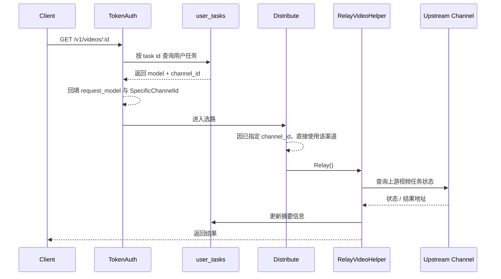
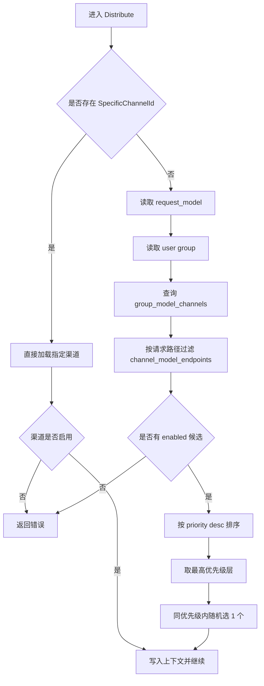
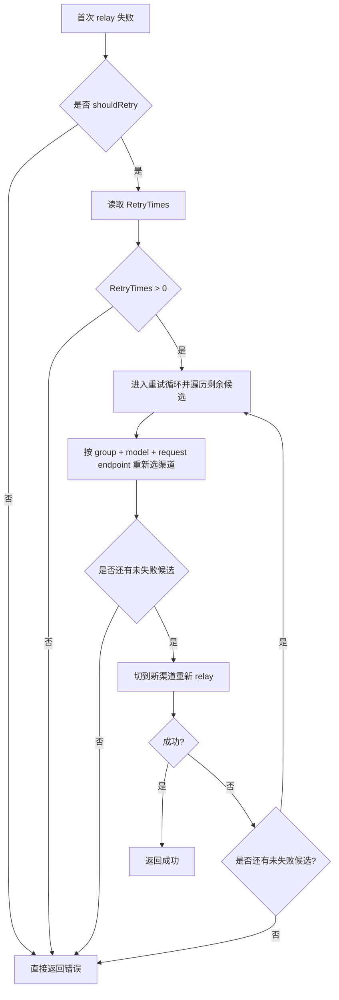

# Router 路由逻辑

本文档描述当前 `main` 分支中已经落地的真实路由基线。

## 这篇文档只回答什么

这篇文档只回答三类问题：

1. 请求如何进入系统、完成鉴权、选路、转发、计费和落日志。
2. 哪些情况下会发生请求内切换，哪些情况下不会。
3. 文本请求在路由阶段如何做端点可用性判断。

这篇文档不展开回答：

1. 每个 API 接口的完整字段定义和返回示例。
2. 各端点协议在请求体、响应体、鉴权头上的详细差异。
3. 供应商、渠道、分组三层的人工配置治理细则。

关联文档：

- API 路径、字段与返回口径见 [接口文档.md](接口文档.md)
- 端点协议差异见 [端点协议.md](端点协议.md)
- 供应商、渠道、分组边界分别见 [供应商规范.md](供应商规范.md)、[渠道规范.md](渠道规范.md)、[分组规范.md](分组规范.md)

目标只有两个：

1. 说明请求是如何进入系统、完成鉴权、选路、转发、计费、记录日志的。
2. 说明当前实现下，哪些情况下会请求内切换渠道，哪些情况下不会。

本文档是“实现基线文档”，不是方案讨论文档。
如代码与本文档冲突，以代码为准，并应及时回写本文档。

## 文档信息

- 最后核对日期：2026-04-07
- 适用分支：`main`
- 关键代码目录：
  - `internal/transport/http/router`
  - `internal/transport/http/middleware`
  - `internal/admin/controller`
  - `internal/admin/model`
  - `internal/admin/repository/group`
  - `internal/relay`

## 1. 核心结论

先给出最重要的实现结论。

1. `/v1/*` 和 `/api/v1/public/*` 两类 relay 入口，最终走的是同一套中继能力。
2. relay 入口统一使用中间件链：`RelayLogger -> TokenAuth -> Distribute -> Relay`。
3. 渠道选择不是 round robin，也不是按实时负载均衡，而是“先按优先级分层，再在同优先级内随机”。
4. 实际可选渠道来源不是 `channel_models`，而是静态展开表 `group_model_channels`。
5. `group_models` 负责表达“分组对外提供哪些模型”；`channel_models` 负责表达“渠道支持哪些模型、模型使用哪个上游模型与端点”；`group_model_channels` 负责表达“某个分组下，这个模型当前有哪些候选渠道承载关系”。
6. 请求内切换是否发生，受 `RetryTimes`、错误状态码、是否指定渠道、候选池规模共同影响。
7. 当前请求内切换策略由 `system_settings.RetryTimes` 控制：`0` 表示关闭，`>0` 表示把剩余候选渠道都尝试一遍。
8. 即使允许请求内切换，也不保证一定切换成功，因为候选池可能被耗尽，或所有优先级层都已尝试失败。
9. 文本模型端点按“同端点转发”处理：下游请求端点必须和渠道已启用端点一致，当前支持 `chat/completions`、`responses`、`messages`。
10. “请求内切换”和“后续请求避开故障渠道”是两套不同机制，不应混为一谈。

## 2. 名词定义

为避免歧义，本文统一使用以下术语：

- `request_model`：客户端请求中的模型名。
- `original_model`：当前请求在 Router 内部用于重试和映射的原始模型名。
- `group_models`：分组维度的模型主表，描述某分组对外提供哪些模型以及供应商归属。
- `channel_models`：渠道维度的渠道模型表，描述渠道支持哪些模型、是否选中、上游模型名、端点等。
- `group_model_channels`：静态展开表，描述某个分组下某模型展开到哪些渠道模型。
- `SpecificChannelId`：上下文中显式指定的渠道 ID，一旦存在，请求内重试会被关闭。
- 请求内切换：同一个 HTTP 请求失败后，在 Router 内部重试并改走另一个渠道。
- 后续请求避障：渠道因错误或余额问题被禁用后，后面的新请求不再选中它。

补充说明：

- `group_model_channels` 是静态展开表，不是人工配置表。
- 这张表由主数据展开生成，允许冗余，但不应被当成配置真相直接编辑。

## 3. 切换类型总览

这一节只做一件事：把“切换”相关概念压成一个固定模板，便于先建立全局认知，再进入后文细节。

### 3.1 术语

- `新请求重新选路`：一个新的 HTTP 请求进入 relay 链路时，重新执行一次选路。
- `请求级重试切换`：同一个请求第一次上游调用失败后，在请求内部重试并尝试改走其他渠道。
- `后续请求切换`：当前请求已经结束，后续新请求因为候选池或渠道状态变化而走向其他渠道。
- `指定渠道固定路由`：请求在进入 `Distribute` 前已带上 `SpecificChannelId`，不再参与正常选路。
- `同端点转发`：下游请求端点与渠道已启用端点一致时，Router 直接按该端点转发。

### 3.2 总图

图的阅读方式：

- 左半部分描述“是否真的换渠道”。
- 右下部分描述“同端点转发判断”，它发生在同一个渠道内部，不属于渠道切换。

### 3.3 总表

| 类型 | 是否真换渠道 | 作用范围 | 是否影响当前请求 | 是否依赖重试策略配置 | 核心触发条件 |
| --- | --- | --- | --- | --- | --- |
| 新请求重新选路 | 是 | 请求之间 | 否 | 否 | 新请求进入 relay，且未指定渠道 |
| 请求级重试切换 | 是 | 同一个请求内部 | 是 | 否 | 首次上游失败，错误可重试，且仍有其他候选 |
| 后续请求切换 | 是 | 请求之间 | 否 | 否 | 渠道状态、候选池或随机结果发生变化 |
| 指定渠道固定路由 | 否 | 同一个请求 | 否 | 否 | 请求进入选路前已携带 `SpecificChannelId` |
| 同端点转发判断 | 否 | 同一个请求 | 是 | 否 | Router 检查渠道是否已启用当前请求端点 |

说明：

- 第 1、2、3 类是真正的“换渠道”。
- 第 4 类是“锁定渠道”，不是切换。
- 第 5 类是“同渠道内的端点可用性判断”，不是切换。

## 4. 路由分层

当前系统有四类核心 HTTP 路由：

| 层级 | 前缀 | 用途 |
| --- | --- | --- |
| 页面与静态资源 | `/` | 管理工作区、用户工作区、静态资源 |
| Public API | `/api/v1/public` | 站内用户接口、用户任务、用户日志、public relay |
| Admin API | `/api/v1/admin` | 渠道、分组、供应商、用户、任务、日志等后台管理 |
| Relay API | `/v1` | 标准 OpenAI 兼容入口 |

## 5. Relay 请求总链路

### 5.1 文本 relay（`/v1/chat/completions`、`/v1/responses`、`/v1/messages`）

### 5.2 `/v1/videos/:id` 或 `/api/v1/public/videos/:id`

## 6. 中间件职责

relay 入口统一中间件链：

1. `RelayLogger()`
2. `TokenAuth()`
3. `Distribute()`

它们的职责边界如下。

### 6.1 `RelayLogger`

作用：

- 记录请求开始日志。
- 记录请求结束日志。
- 输出最终选中的 `channel_id`、`channel_name`、`upstream_url`、`upstream_status`、`retry_count`、`error`。

它只负责日志，不参与选路。

### 6.2 `TokenAuth`

作用：

- 识别钱包 JWT、UCAN、普通 `sk-` token。
- 提取 `request_model`。
- 校验 token 的模型权限范围。
- 写入 `user_id`、`token_id`、`token_name`。
- 对视频查询请求，通过 `user_tasks` 回填 `request_model` 和 `SpecificChannelId`。
- 管理员 token 才允许通过 `sk-xxx-channelId` 方式显式指定渠道。

### 6.3 `Distribute`

作用：

- 读取用户分组。
- 根据 `group + request_model` 查候选渠道。
- 按优先级和随机规则选一个渠道。
- 把选路结果写入上下文，供后续 relay 使用。

## 7. 选路规则

### 7.1 候选池从哪里来

候选池来源不是 `channels`，也不是 `channel_models` 单独决定，而是：

1. `users.group` 决定当前用户属于哪个分组。
2. `group_models` 决定这个分组对外暴露哪些模型。
3. `group_model_channels` 决定这个分组下、这个模型有哪些候选渠道承载关系。
4. `channel_models` 决定该渠道上的渠道模型字段，例如：
   - `selected`
   - `upstream_model`
   - `endpoint`
5. `channel_model_endpoints` 决定该渠道的这个模型，在当前请求端点上是否还能继续参与选路。

可理解为：

- `group_models` 决定“这个分组理论上暴露什么模型”。
- `channel_models` 决定“渠道声明自己支持什么”。
- `group_model_channels` 决定“Router 可从哪些渠道候选里为这个分组承载这些模型”。
- `channel_model_endpoints` 决定“这个请求打到哪个下游端点时，这条渠道能力是否还有效”。

### 7.2 选路流程图

### 7.3 当前选路特征

当前选路不是：

- round robin
- 一致性哈希
- 动态最小负载
- 按余额排序
- 按实时成功率排序

当前选路是：

- 先按 `priority desc` 排序。
- 只在最高优先级层内选择。
- 同优先级内随机。

## 8. 请求内切换规则

这一节只讨论“同一个请求失败后，Router 会不会再试另一个渠道”。

### 8.1 触发条件

要发生请求内切换，必须同时满足：

1. 当前请求未指定 `SpecificChannelId`。
2. 错误状态码满足 `shouldRetry`。
3. `RetryTimes > 0`。
4. 当前分组下该模型存在其他候选渠道。
5. 这些候选渠道在当前请求端点上仍然可用。

### 8.2 `shouldRetry` 规则

当前实现：

- 有 `SpecificChannelId`：不重试。
- `429`：重试。
- `5xx`：重试。
- `400`：不重试。
- 其他非 `2xx`：重试。

### 8.3 重试流程图

### 8.4 当前实现的重要限制

1. 请求内切换策略取自运行时配置 `RetryTimes`。

2. 重试时会排除同一次请求里已经失败过的渠道。  
这意味着只要候选池里还有未失败的渠道，Router 不会再次打回同一条已失败渠道。

3. 启用后，Router 会持续重试直到剩余候选耗尽或某次成功。每一轮仍然优先选择“当前仍未失败的最高优先级层”。  
只有当这一层已经没有剩余候选时，才会自动降级到下一优先级层。

### 8.5 对生产排障的直接解释

如果生产环境：

- `system_settings.RetryTimes=0`

那么结论就是：

- `429` 不会触发请求内切换。
- 同一个请求只会打一次上游，失败后直接返回。

## 9. 后续请求避障规则

这一节讨论的不是“当前请求内切换”，而是“后面的新请求是否还会继续选中故障渠道”。

### 9.1 三类机制

后续请求避障主要依赖四类机制：

1. 模型级能力摘除。
2. 端点级能力摘除。
3. 自动禁用渠道。
4. 人工或任务刷新余额后禁用渠道。

### 9.2 能力级摘除

当前对一部分“模型或端点在该渠道上不可用”的错误，已经下沉到能力层处理，而不是直接禁用整条渠道。

当前已覆盖的典型场景：

- `code = model_not_found`
- 明显是模型权限问题的 `permission_error`
- `code = unsupported_channel_endpoint`

处理方式：

1. 模型级错误：
   - 将对应 `channel_models` 行标记为 `inactive=true`
   - 同时将该行 `selected=false`
   - 然后刷新该渠道关联的 `group_model_channels`

2. 端点级错误：
   - 将对应 `channel_model_endpoints` 行标记为 `enabled=false`
   - 不会直接把整个 `channel_model` 摘掉
   - 后续同模型但其他端点仍可继续参与选路

这会影响后续新请求，但不影响当前已经失败的请求。

### 9.3 自动禁用渠道

当前逻辑由 `monitor.ShouldDisableChannel(...)` 控制。

只有当 `AutomaticDisableChannelEnabled=true` 时才会生效。

典型触发条件包括：

- `401`
- `insufficient_quota`
- `authentication_error`
- 非模型级的 `permission_error`
- `forbidden`
- 错误消息中包含 `credit`、`balance`、`api key expired`、`已欠费` 等

### 9.4 余额刷新禁用

当后台主动刷新渠道余额时：

- 若余额查询成功且 `balance <= 0`
- 会禁用该渠道

这属于“后续请求避障”，不是“当前请求内切换”。

### 9.5 三者区别

| 机制 | 作用时机 | 是否影响当前请求 |
| --- | --- | --- |
| 请求内切换 | 当前请求失败后立即重试 | 是 |
| 模型级能力摘除 | 当前请求结束后改变某个 `channel_model` 的可用性 | 否 |
| 端点级能力摘除 | 当前请求结束后改变某个 `channel + model + endpoint` 的可用性 | 否 |
| 自动禁用 / 余额禁用 | 当前请求结束后改变渠道状态 | 否 |

## 10. 文本端点校验与转发

这一节只描述路由阶段实际会做什么，不重复解释各协议差异。

- 协议差异、供应商风格、管理端协议选择，见 [端点协议.md](端点协议.md)。
- 本节只关心：当前请求进入 Relay 之后，Router 如何判断一个渠道能不能承接该文本端点。

### 10.1 当前已落地规则

1. 当前文本请求只支持同端点转发；下游请求端点必须与渠道模型已启用端点一致。
2. 文本端点能力按渠道模型的已启用端点判断，不做自动互转，也不回落到其他文本端点。
3. 协议初始行为（无模型端点配置时）：
   - `openai` 系文本渠道初始走 `/v1/responses`。
   - `anthropic/aws-claude` 初始走 `/v1/messages`。
   - 该初始值只用于首次生成配置；真实请求仍以渠道模型已启用端点为准。
4. 候选渠道过滤仍有历史兼容判定，但最终以上游协商结果为准；
   即使前置过滤放行，若端点不满足上述规则，最终也会在协商阶段拒绝。

### 10.2 端点协商总表

| 下游端点 | 渠道模型是否已启用同名端点 | 转发结果 |
| --- | --- | --- |
| `/v1/responses` | 是 | 转发到 `/v1/responses` |
| `/v1/responses` | 否 | 拒绝 |
| `/v1/messages` | 是 | 转发到 `/v1/messages` |
| `/v1/messages` | 否 | 拒绝 |
| `/v1/chat/completions` | 是 | 转发到 `/v1/chat/completions` |
| `/v1/chat/completions` | 否 | 拒绝 |

### 10.3 请求体规范化

1. `responses` 请求：`input` 会规范化为 array 语义，便于后续统一处理。
2. `messages` 请求：会进入内部统一消息结构，再走校验、计费、转发。
3. `chat` 请求：保持 `messages` 语义进入后续链路。

### 10.4 模型测试与真实 relay 的关系

后台模型测试会按“待测端点”构造请求：

- 测 `/v1/responses`：构造 responses 风格请求体。
- 测 `/v1/chat/completions`：构造 chat 风格请求体。
- 测 `/v1/messages`：构造 messages 风格请求体。

另外，文本测试响应解析当前覆盖三种返回形态：

- OpenAI chat（`choices[].message.content`）
- OpenAI responses（`output[].content[]`）
- Anthropic messages（`content[].type=text`）

### 10.5 `stream` 与 `Accept` 的当前规则

1. `stream` 是 Router 内部唯一的流式语义来源。
2. Router 会按 `stream` 生成上游 `Accept`：
   - `stream=true` -> `Accept: text/event-stream`
   - `stream=false` -> `Accept: application/json`
3. 下游自带的 `Accept` 不再直接透传到 OpenAI / Anthropic 上游。
4. 若下游 `stream` 与 `Accept` 冲突，当前只记录告警日志，不拦截请求。

## 11. 图片、音频、视频

### 11.1 图片

当前已支持：

- `/v1/images/generations`

图片测试成功时，测试结果文件可落盘到本地测试产物目录，并通过后台下载接口获取。

### 11.2 音频

当前已支持：

- `/v1/audio/transcriptions`
- `/v1/audio/translations`
- `/v1/audio/speech`

### 11.3 视频

当前已支持：

- `POST /v1/videos`
- `GET /v1/videos/:id`
- `POST /api/v1/public/videos`
- `GET /api/v1/public/videos/:id`

视频链路的关键特征：

- 创建请求走正常 relay。
- 查询请求通过 `user_tasks` 回填渠道与模型。
- `user_tasks` 用于保存业务任务可见性，而不是系统调度任务。

## 12. 任务分层

当前任务模型分为两类。

### 12.1 系统任务 `admin_tasks`

主要承载：

- 渠道模型测试
- 渠道刷新模型
- 渠道刷新余额

对应接口：

- `GET /api/v1/admin/tasks`
- `GET /api/v1/admin/tasks/:id`
- `POST /api/v1/admin/tasks/:id/cancel`
- `POST /api/v1/admin/tasks/:id/retry`

### 12.2 用户任务 `user_tasks`

主要承载：

- 视频业务任务

对应接口：

- `GET /api/v1/public/user/tasks`
- `GET /api/v1/public/user/tasks/:id`
- `GET /api/v1/admin/user/tasks`
- `GET /api/v1/admin/user/tasks/:id`

## 13. 当前最容易误解的 6 个点

1. “渠道支持模型”不等于“当前分组可选该渠道”。  
必须进入 `group_model_channels` 才算候选池成员。

2. “有多个渠道”不等于“请求级重试切换一定发生”。  
还要满足 `RetryTimes > 0`、错误可重试、未指定渠道。

3. “自动禁用渠道”不等于“当前请求会立即切换”。  
自动禁用更多影响后续请求。

4. “切换失败”不一定是没有备份渠道。  
也可能是当前优先级层已耗尽，或者降级后没有剩余候选。

5. “同端点转发判断”不是渠道切换。  
它发生在同一个渠道内部。

6. “日志里写上游负载饱和”不一定是上游真实原文。  
当前 `429` 最终会被统一包装成对客户端更稳定的错误文案。

## 14. 运维排障建议

当你怀疑“为什么没有切换渠道”时，优先查下面四件事：

1. `system_settings.RetryTimes` 是否存在，值是多少。
2. 当前请求是否存在 `SpecificChannelId`。
3. 当前分组下，该模型在 `group_model_channels` 里到底有几个候选渠道承载关系。
4. 候选渠道优先级是否都在同一层，是否有机会被随机切到别的渠道。

补充：当前 `RETRY` 日志会输出 `selection_scope`、`selected_priority`、`tier_candidates`、`remaining_candidates`、`failed_channels`，可直接判断是“同层继续重试”、“已降级到下一层”，还是“候选已经耗尽”。

## 15. 文档边界

本文档只描述“当前真实实现”。

不在本文档中讨论：

- 理想化负载均衡策略
- 未来的动态成功率调度
- 权重路由优化
- 自动熔断与恢复的目标方案

这类内容应放在独立设计文档中。

目标错误分类与处理策略，见 [渠道错误处理策略](./渠道错误处理策略.md)。
